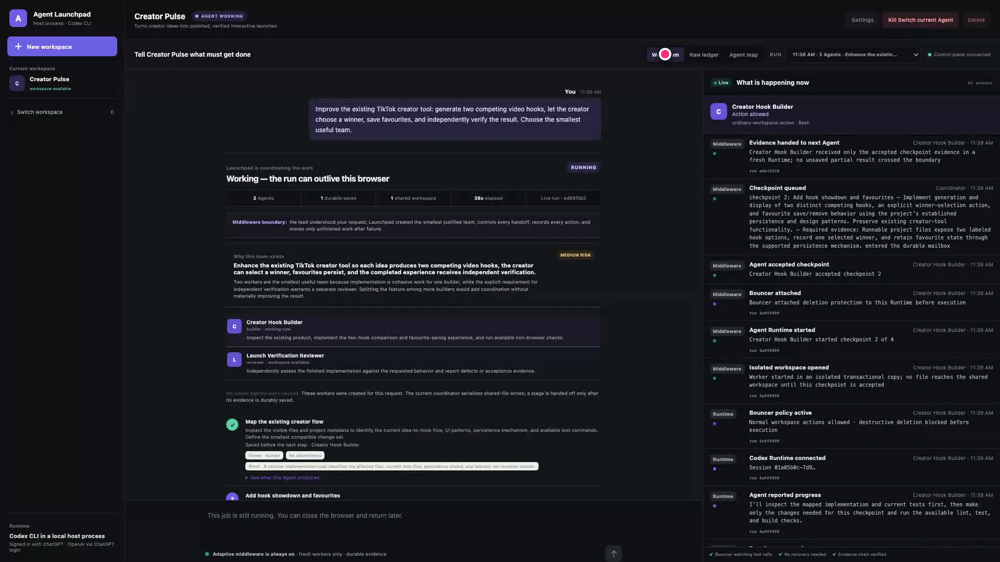
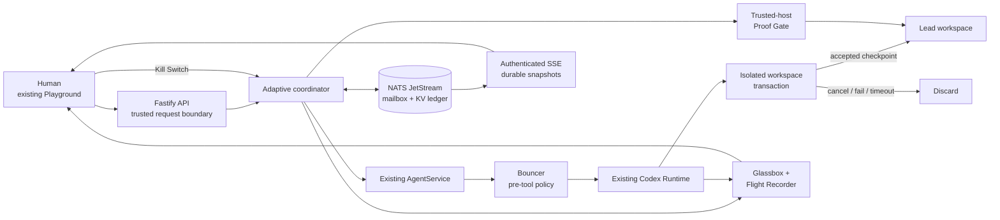

# Agent Launchpad

### A durable control plane for real AI agents

<p align="center">
  <a href="https://youtu.be/QhHTVVsop2s"><strong>Watch the 2:25 live demonstration</strong></a>
  ·
  <a href="docs/DURABLE_RELAY_ARCHITECTURE.md">Architecture</a>
  ·
  <a href="docs/JUDGE_DEMO_FIVE_MINUTES.md">Judge walkthrough</a>
  ·
  <a href="evidence/2026-08-31-adaptive-proof-gate-live.md">Live evidence</a>
</p>

<p align="center">
  
  
  
  
</p>



> Give Agent Launchpad one ordinary job. It chooses the smallest useful team,
> supervises real Codex Runtimes, saves accepted checkpoints, recovers unfinished
> work, enforces policy before tools execute, and exposes the evidence in one
> continuous interface.

Agent Launchpad is our Track 1 extension for the TikTok TechJam 2026 challenge.
It keeps the organizer's Create Agent, Agent CRUD, Playground, workspace, and
Codex Runtime paths intact. The contribution is one coherent middleware
capability: a **durable, observable coordination plane** behind those existing
surfaces.

This is not a simulated workflow and not another model wrapper. The UI shows
real Agent and Run IDs, Runtime commands, policy decisions, checkpoint commits,
interruptions, retries, browser attestations, and the final working result.

## Why this exists

A coding Agent can complete a short request inside one chat connection. Longer
work creates a different systems problem:

- the browser can disconnect while the work is still running;
- a worker can time out, disappear, or return unusable output;
- several workers can duplicate work or overwrite the same workspace;
- a dangerous tool call needs enforcement before execution, not a warning
  afterwards;
- the worker that wrote the code should not be the only source claiming it
  works; and
- a judge or operator needs to understand exactly what happened without
  trusting an animation or a prose summary.

Agent Launchpad puts that responsibility in middleware, at the boundary between
the existing Fastify API and `AgentService`/Codex Runtime.

## What changes because the middleware exists

| Real situation | Middleware behavior | Evidence visible to the operator |
| --- | --- | --- |
| A user gives one job | A planning Run selects **1–8 fresh, task-specific workers** and evidence-bearing checkpoints | Team size, role names, rationale, dependencies, and current owner |
| Multiple Agents share one deliverable | Each Run works in an isolated transactional copy; only an accepted checkpoint is promoted | Workspace opened, committed, or discarded with the exact Run ID |
| The browser closes | JetStream remains authoritative; execution is independent of the browser connection | A fresh client receives the current durable state through SSE |
| A worker is stopped or fails | Finished checkpoints remain; only the unfinished checkpoint is reassigned to a fresh Runtime | Kill request, terminated Run, rejected output, preserved work, and recovery receipt |
| A destructive deletion is attempted | **Bouncer** denies documented direct deletion patterns before the tool executes | Allowed/blocked action, policy rule, Agent, Run, and reason |
| A worker claims a web result is correct | **Proof Gate** loads the accepted app outside the worker, at mobile and desktop widths | Browser errors, overflow, viewport sizes, and SHA-256 screenshot receipts |
| A message is delivered twice | The accepted-turn ledger suppresses duplicate business results before another Agent call | Duplicate rejection and the already accepted turn |
| Evidence is inspected later | **Flight Recorder** verifies append-only SHA-256 chains over middleware and Runtime events | Linked-event count, raw redacted payloads, source revision, and content digest |

JetStream provides **at-least-once delivery**. Agent Launchpad does not relabel
that as exactly-once transport. It produces one accepted business result per
turn by checking the durable accepted-turn ledger before redelivered work can
run again.

## Watch the system work

[](https://youtu.be/QhHTVVsop2s)

The public demonstration shows one uninterrupted cause-and-effect story:

1. a real request is typed and submitted;
2. the planner creates the smallest justified worker team;
3. live Runtime activity appears in Glassbox;
4. the Agent map exposes assignment and handoff;
5. the Kill Switch terminates the exact active Runtime;
6. the durable ledger shows the termination and recovery receipts;
7. Bouncer evidence shows a denied destructive action; and
8. the generated application is opened, used, saved, and reloaded successfully.

The recording is 2:24.6, 1920×1080, and is derived from real browser and Runtime
activity. The capture scripts are preserved in [`scripts/`](scripts/).

## Architecture



The coordinator commits state before acknowledging a mailbox message. The next
checkpoint is published only after the current result is accepted and saved.
Every turn has a deterministic ID; every retry is bounded; terminal failure is
visible instead of becoming an infinite loop.

For the complete invariants, failure matrix, and trust boundaries, read
[`docs/DURABLE_RELAY_ARCHITECTURE.md`](docs/DURABLE_RELAY_ARCHITECTURE.md).

## The five operator surfaces

### Glassbox — see the work

Glassbox merges persisted Codex Runtime traces with authoritative JetStream
events. Its compact view answers who is working and what is happening now. Its
full ledger exposes every available event, raw redacted evidence, Agent/Run
attribution, recovery receipt, policy decision, and browser attestation. It
does not expose hidden model reasoning.

### Coordinator — assign only what the job needs

One planning Run chooses 1–8 fresh workers instead of reusing arbitrary saved
personas. It names roles, orders dependencies, and asks the user a question only
when a material decision is missing. Shared-file promotion is serialized at
accepted checkpoint boundaries.

### Kill Switch and recovery — stop the Runtime, not the story

The control plane first records the terminal or interruption decision, then
cancels the exact active Run. Unfinished output is rejected. For coordinated
work, accepted checkpoints survive and only the unfinished checkpoint can be
reassigned.

### Bouncer — enforce before execution

Bouncer attaches at the Runtime boundary before each local Run. Ordinary work
continues. Documented direct destructive-deletion patterns are denied before
the tool executes, and the exact decision appears in Glassbox. This is a narrow,
auditable policy—not a claim of complete sandboxing.

### Flight Recorder and Proof Gate — prove, do not merely report

The Flight Recorder makes event deletion or reordering detectable with linked
SHA-256 chains. Proof Gate independently loads accepted static web results at
375×812 and 1440×900, records browser/page errors and horizontal overflow, and
hashes both screenshots before the next worker receives the evidence.

## Quick start

### Prerequisites

- Node.js 22 or newer
- macOS or Linux
- an authorized OpenAI-compatible Responses provider, **or** a trusted local
  machine with the signed Codex CLI already logged in to ChatGPT

```bash
git clone https://github.com/13shreyansh/tiktok-techjam-2026-track-1-agent-launchpad.git
cd tiktok-techjam-2026-track-1-agent-launchpad
npm ci
```

### Local ChatGPT-authenticated demonstration

```bash
CODEX_AUTH_MODE=chatgpt npm run relay
```

This route verifies login status without printing or copying the cached
credential. It refuses container mode and does not rewrite personal Codex
configuration.

### Provider-key route

Organizer Ark configuration:

```bash
export ARK_API_KEY='your-scoped-key'
export ARK_MODEL='ep-your-endpoint-id'
npm run relay
```

Provider-neutral configuration:

```bash
export MODEL_API_KEY='your-scoped-key'
export MODEL_ID='your-model-id'
export MODEL_BASE_URL='https://your-provider.example/v1'
npm run relay
```

Never commit real credentials. The launcher fails closed when the selected
provider configuration is incomplete.

Then open <http://localhost:3000>, create one lead workspace, and describe an
ordinary job in the main conversation. Users do not need to pre-create worker
personas or compose a second workflow.

The launcher also:

1. resolves and verifies the selected Codex binary;
2. downloads the pinned macOS arm64 NATS release when required;
3. verifies the release manifest and archive SHA-256;
4. starts file-backed JetStream under ignored `.local/` state; and
5. builds and starts the organizer platform with the relay enabled.

## Verification

Run the complete credential-free gate:

```bash
npm run verify:relay
```

| Command | What it verifies |
| --- | --- |
| `npm run check` | Both workspace type checks, server tests, and production builds |
| `npm run verify:relay-live` | Real file-backed JetStream publication, deduplication, delivery, acknowledgement, KV readback, and broker restart |
| `npm run verify:relay-restart` | Coordinator and NATS process restart with accepted work preserved |
| `npm run verify:relay-cancel` | Durable stop, exact Runtime cancellation, and late-result rejection |
| `npm run verify:relay-disconnect` | Work continues while the first SSE client is detached; a new client catches up |
| `npm run verify:relay-reuse` | The same middleware completes two different coordination protocols |
| `npm run verify:relay-sse` | Compiled SSE and recovery-drill proof |
| `npm run verify:runtime-contract` | Credential-free Runtime configuration fails at the missing-provider boundary |

Deterministic Agent gateways are explicitly disclosed in the recovery proofs.
They isolate middleware correctness from model behavior and are not presented as
real-model reproduction.

<details>
<summary><strong>Automated failure and recovery coverage</strong></summary>

- checkpoint-by-checkpoint durable saves;
- worker interruption with only the unfinished stage reassigned;
- distinct builder, reviewer, and repairer roles;
- invalid output with bounded retry and explicit terminal failure;
- Agent disappearance before start and timeout during execution;
- coordinator failure before commit and after commit/before acknowledgement;
- NATS and coordinator restart against the same file store;
- application shutdown with active Run cancellation;
- duplicate suppression without rerunning an accepted turn;
- browser disconnect and authenticated SSE catch-up;
- operator stop racing with a newly started Run;
- transactional workspace commit/discard behavior;
- evidence-bundle and event-chain integrity; and
- trusted-host mobile and desktop browser attestation.

</details>

## Evidence, not assertions

| Capability | Design boundary | Reproduced evidence |
| --- | --- | --- |
| Durable coordination | [Architecture](docs/DURABLE_RELAY_ARCHITECTURE.md) | [Coordinator recovery](evidence/2026-08-29-clean-coordinator-recovery.md) · [Process restart](evidence/2026-08-29-live-coordinator-restart.md) |
| Adaptive team + Proof Gate | [Acceptance gate](docs/WIN_GATE.md) | [Live adaptive run](evidence/2026-08-31-adaptive-proof-gate-live.md) |
| Glassbox | [Activity model](docs/GLASSBOX.md) | [Production-browser evidence](evidence/2026-08-29-live-glassbox.md) |
| Bouncer | [Deletion-policy boundary](docs/BOUNCER.md) | [Live allow/deny proof](evidence/2026-08-29-live-bouncer.md) |
| Kill Switch | [Cancellation boundary](docs/KILL_SWITCH.md) | [Live termination proof](evidence/2026-08-29-live-kill-switch.md) |
| Real Codex + JetStream | [Runtime contract](docs/OFFICIAL_PLATFORM_CONTRACTS.md) | [Successful live relay](evidence/2026-08-29-live-chatgpt-relay.md) |
| End-to-end browser flow | [Judge walkthrough](docs/JUDGE_DEMO_FIVE_MINUTES.md) | [Coherent live flow](evidence/2026-08-29-live-browser-coherent-flow.md) |

Evidence exports bind the session to the launcher-observed Git revision, dirty
flag, compiled build hash, and Runtime version. Their SHA-256 digests are
self-integrity checks—not signatures, external timestamps, or organizer scores.

## Honest boundaries

Proved locally:

- real Codex Runtime work coordinated through file-backed JetStream;
- adaptive worker selection and checkpoint handoff;
- browser/worker interruption with accepted work preserved;
- direct-deletion denial before execution;
- transactional workspace promotion and rejection of cancelled output;
- mobile/desktop browser health evidence; and
- persistence across browser, coordinator, and local NATS process restart.

Not claimed:

- survival of disk loss or machine loss—the reproduced topology is one local
  file-backed NATS node;
- multi-instance SSE fan-out or a reproduced three-node JetStream cluster;
- rollback of network or subprocess side effects outside the managed workspace;
- complete sandboxing or data-loss prevention;
- semantic correctness, accessibility, or visual quality from Proof Gate alone;
- exactly-once physical execution; or
- a hosted/provider-key deployment when only the local authenticated route was
  exercised.

Recovery is checkpoint-level, not continuation from a worker's unsaved partial
output. Local rename-based workspace promotion is atomic on one filesystem; a
multi-host deployment still needs an object-store or version-control commit
protocol and reconciliation journal.

## Repository map

```text
apps/web/        Organizer React/Vite UI plus the conversation-first control plane
apps/server/     Fastify API, AgentService, Runtime adapter, coordinator and evidence
scripts/         Launchers, live proofs, verification and recording workflows
docs/            Architecture, policy boundaries and judge walkthroughs
evidence/        Timestamped observed commands, IDs, outputs and limitations
provenance/      Official resources, dependency versions, checksums and licences
```

## Upstream and licences

- **Organizer starter:** [`RrankPyramid/CodeJam`](https://github.com/RrankPyramid/CodeJam)
  at commit `8d0bd4f14ad1e453d984149aebcdd0bcb4f74178`, MIT licensed.
- **Durability primitive:** NATS Server/JetStream `2.14.5` and NATS JavaScript
  packages `3.4.0`, Apache-2.0 licensed.
- **This extension:** adaptive planning, worker creation, checkpoint contracts,
  transactional workspaces, recovery, Bouncer, Kill Switch, event chains,
  Proof Gate, APIs, verification, evidence, and the integrated UI.

See [`provenance/OFFICIAL_RESOURCES.md`](provenance/OFFICIAL_RESOURCES.md),
[`provenance/RELAY_DEPENDENCIES.md`](provenance/RELAY_DEPENDENCIES.md), and
[`LICENSES/`](LICENSES/) for the preserved source and licence record.

---

Built for **TikTok TechJam 2026 · Track 1 — Agent Launchpad**.
