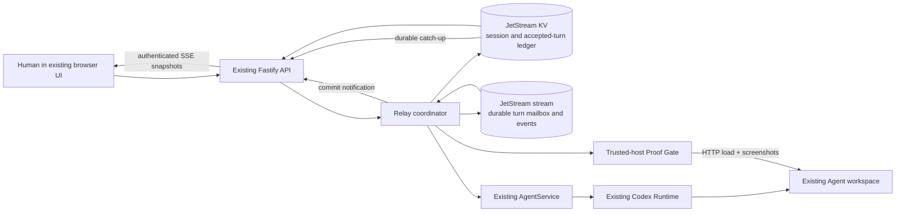

# Durable Agent Relay architecture

## One capability at a trusted boundary

The extension sits between the request boundary and the existing
`AgentService`. It does not replace the organizer's Agent CRUD, Playground,
workspace, or Runtime. A checkpoint-workflow session stores its participants,
user job, 2–8 checkpoint descriptions, current checkpoint, attempts, accepted
results, and event timeline in JetStream KV. Each checkpoint is a deterministic
message in the JetStream stream. The coordinator claims that message, calls the
assigned existing Agent, validates a usable result, commits it using KV
compare-and-set, publishes the next checkpoint, and only then acknowledges the
current message. The older team-task, countdown, and ordered-sequence sessions
use the same mailbox and ledger as secondary or backwards-compatible protocols.

## Correctness invariants

1. Only the current durable checkpoint may be accepted.
2. A checkpoint turn ID is deterministic: `<session-id>:turn:<checkpoint>`.
3. A turn already present in `acceptedTurns` never calls an Agent again.
4. State is committed before the message is acknowledged.
5. The next checkpoint is published only after the current result and its
   `checkpoint.saved` event are committed.
6. Publish message IDs are deterministic, allowing JetStream duplicate
   detection to suppress repeated publications inside its duplicate window.
7. Attempts are persisted before an Agent starts, so a pre-completion crash
   advances to the next participant after redelivery.
8. Retry count is bounded; exhaustion enters a visible terminal `failed`
   state rather than looping forever.
9. The opt-in Recovery Drill is stored in session state and injects one
   pre-run failure. It records the chosen Agent and attempt but creates no Run
   and no output; the replacement Agent remains subject to exact validation.
10. An operator stop is committed as terminal durable state before the active
    Run is cancelled. A Run that starts concurrently with that commit is
    cancelled when its stale state write is rejected, and its output cannot be
    accepted.
11. The latest artifact producer cannot review that artifact. With three
    available Agents, repair also prefers an Agent distinct from both the
    producer and reviewer.
12. The **Disconnect active worker** action first commits a structured
    interruption request with the exact Run and Agent IDs, then cancels the
    real active Runtime process. Final cancellation status is committed
    separately, the output is rejected, and the same deterministic stage is
    reassigned. The attribution survives coordinator restart instead of
    depending on process memory or descriptive text.
13. Startup appends a durable `coordinator.recovered` event before republishing
    pending work. The event freezes the abandoned Run/Agent/attempt IDs, clears
    stale active-process state, and tells the UI exactly how many completed
    checkpoints survived.
14. After an accepted checkpoint is promoted, the optional Proof Gate serves
    the accepted static build from a temporary loopback HTTP server and opens it
    in a trusted-host browser. Its receipt is committed before the next
    checkpoint prompt is constructed, so the next worker sees evidence produced
    outside its own Runtime sandbox.

These rules provide one **accepted** result per business turn on top of an
at-least-once transport. They do not claim exactly-once physical execution.

## Failure matrix

| Failure point | Durable fact before failure | Recovery behavior |
| --- | --- | --- |
| Browser disconnects | Session, mailbox, and events are in JetStream | Run continues; a fresh SSE client receives current durable state |
| SSE connection drops | Browser holds no authoritative relay state | Client reconnects and receives a fresh durable snapshot |
| Agent cannot start | Claim and attempt are in KV | Message is negatively acknowledged and reassigned |
| Operator disconnects active worker | Active Run ID and claim are in KV | Cancel the real Run, reject unfinished output, preserve earlier checkpoints, and restart only the same checkpoint |
| Operator enables Recovery Drill | Fault mode is durable session configuration | First claim records `fault.injected` before any model call, then reassigns |
| Operator stops a live relay | Terminal `session.cancelled` state is committed first | Cancel the exact active Run, record the outcome, acknowledge queued work, and reject any late result |
| Agent Run starts concurrently with operator stop | The terminal session wins the KV compare-and-set race | Cancel the newly known Run, record it, and accept no output |
| Draft/repair is empty or unusable | Run is visible; result is not accepted | Retry next Agent, then fail at the configured bound |
| Reviewer violates JSON/check contract | Candidate remains saved; malformed review is not accepted | Retry a different eligible reviewer, then fail at the configured bound |
| Review requests changes | Candidate and criterion evidence are saved | Route complete repair to another Agent, save a new version, and review again |
| Agent remains running past the turn deadline | Run ID and deadline are known | Cancel that exact Run, ignore any late result, and reassign the turn |
| Application receives SIGINT/SIGTERM | Active executions are tracked by Agent | Stop relay intake, cancel active Runs, then close HTTP and exit |
| Coordinator dies before commit | Message is unacknowledged | JetStream redelivers; persisted attempt selects replacement |
| Coordinator dies after commit, before ack | Turn is in `acceptedTurns` | Redelivery is acknowledged without rerunning the Agent |
| Coordinator restarts with pending work | `expectedValue`, accepted checkpoints, attempts, and active attribution are in KV | Startup records `coordinator.recovered`, clears stale active-process state, and republishes only the deterministic pending turn |
| NATS process restarts | Stream, consumer, and KV use file storage | Local state and acknowledgement floor are restored |

The combined live proof terminates both coordinator and NATS processes after
one accepted value, then restores the same storage and completes the remaining
sequence in fresh processes. The deterministic Agent gateway used by this
proof is intentionally disclosed and isolates recovery from model behavior.
Another live proof disconnects the first SSE client at zero accepted values,
allows all ten turns to complete without a client, and verifies a new client
receives the exact completed sequence.

A separate live reuse proof creates a countdown session and an ordered handoff
session against the same coordinator and JetStream instance. It observes exact
outputs `3,2,1` and `PLAN,BUILD,TEST,SHIP`, demonstrating that durability,
assignment, recovery, and evidence are protocol-independent.

The primary real-model proofs cover both process boundaries. The fresh
`ORBIT-742` handoff cancels one active worker and preserves two prior
checkpoints across browser reload. The clean-source `SUMMIT-804` handoff stops
the coordinator with checkpoint 3 active, restores two accepted checkpoints,
records `coordinator.recovered`, restarts only checkpoint 3 at attempt 2, and
finishes `5/5`. Exact receipts and honest limits are recorded in the durable
session and `PREPARATION_STATUS.md`.

## Trust and deployment boundary

The application validates participant IDs, task/criterion bounds, stage order,
review shape, and distinct reviewer identity. A reviewer PASS is independent
model judgment against user criteria, not deterministic semantic truth.
JetStream is trusted for durable bytes and delivery, not for business
correctness. The local proof uses one NATS node bound to localhost.
For production availability, use authenticated TLS connections and a
three-node JetStream cluster; that topology is not reproduced here and is not
needed to prove the challenge capability locally.

No keys, hidden reasoning, or unrelated workspace contents are copied into the
relay. The user's task, criteria, saved deliverable, review evidence, Agent IDs,
Run IDs, attempts, statuses, and operational reasons are deliberately durable
session data. Users must not put secrets or regulated content in a task unless
the deployment's data policy permits storing it.

Coordinated file writes now use a workspace transaction. A worker receives a
private recursive copy of the lead workspace identified by its Run ID. The
copy is atomically promoted only after the Run completes and the checkpoint
output contract passes. Cancellation, timeout, retry, and coordinator recovery
discard the private copy, so the shared workspace remains at the last accepted
checkpoint. Glassbox records `workspace.opened`, `workspace.committed`, and
`workspace.discarded` at that boundary.

This guarantee is intentionally limited to files inside the managed workspace.
It does not roll back external network effects, subprocess effects outside the
workspace, or actions against third-party services. The local rename-based
promotion is atomic on one filesystem, but it is not a distributed transaction
with JetStream; a production multi-host design still needs an object-store or
version-control commit protocol and reconciliation journal.

The Glassbox inspector reads the persisted Agent Run receipts and the durable
Relay session. The Runtime adapter records observable progress messages,
commands and exit codes, file changes, tool calls, web searches, and lifecycle
events as each JSONL event arrives. It does not expose hidden model reasoning.
Obvious credential patterns and the local username are redacted before trace
storage; this is a display safeguard, not a complete data-loss-prevention
system. Relay handoffs, stops, retries, duplicate rejection, and coordinator
recovery remain authoritative JetStream events and are merged with the Runtime
trace in timestamp order. The resulting inspector is therefore backed by real
execution evidence rather than a UI animation or a seeded script.

The trusted-host Proof Gate is deliberately separate from the Codex Runtime.
It checks whether an accepted static app actually loads at 375x812 and
1440x900, whether it emits console/page errors, whether it contains visible
content and headings, and whether it overflows horizontally. It stores hashed
screenshots under ignored application state and exposes them through a
read-only receipt endpoint. This proves browser loading and basic responsive
health; it does not prove arbitrary task-specific interactions, accessibility,
semantic correctness, or visual quality. Those still require live inspection.

The evidence endpoint reads the same durable session and computes sequence or
team-task facts, uniqueness, retry, distinct-reviewer identity, artifact hash,
structured interruption records, and every started Run receipt, including
rejected cancelled attempts. Schema 8 includes each available Run's observable
Glassbox trace. Schema 9 verifies independent SHA-256 chains for the middleware
events and each Runtime trace, exposing missing or reordered records. It also
stores the launcher-observed Git
revision, dirty flag, compiled build hash, and Runtime version in the session
at creation time, so a later server cannot rebind an older run. Legacy sessions
without stored source identity export `unknown`. One SHA-256
covers the timestamped export snapshot; a second excludes `generatedAt`, so
repeated exports of unchanged content share a stable digest. Both are
self-integrity checks, not authenticity signatures or external timestamps.
Schema 10 also exports trusted-host browser-attestation receipts and their
screenshot hashes. The screenshots remain ignored local artifacts rather than
large committed outputs.
